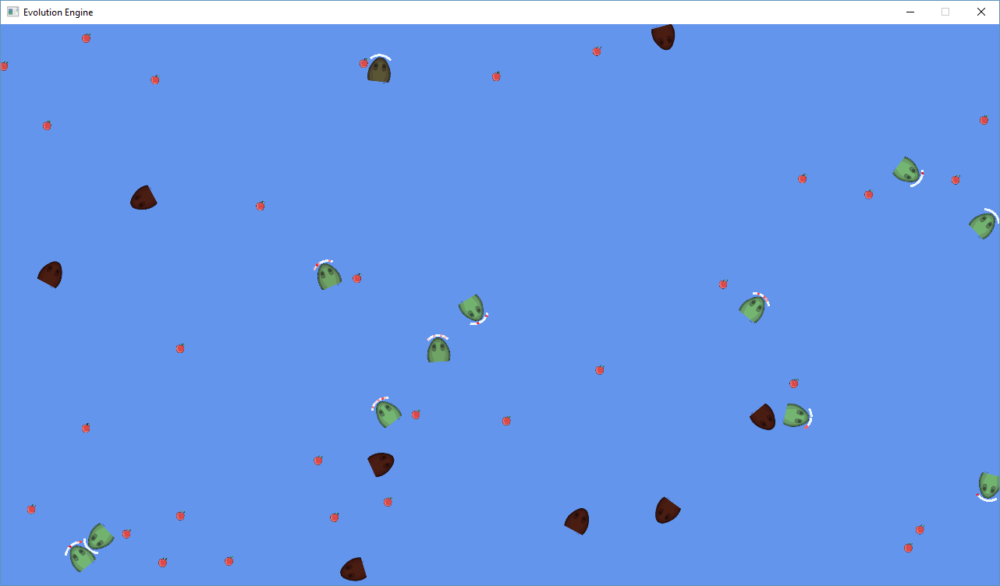

# GeneticEvolution

Fiz esse projeto com o objetivo de desenvolver um Algoritmo Evolucionário usando os conceitos da Genética aplicados numa rede neural que possa ser extraído e usado em outros projetos de maneira fácil.

Esse projeto foi utilizado no desenvolvimento de uma Inteligência Artificial adaptativa para o jogo Ultima Online onde os NPCs (personagens controlados por computador) desenvolvem comportamento e habilidades de combate de acordo com as mecânicas do jogo e também de acordo como os jogadores interagem com eles. 

## Exemplo do projeto

Dentro existe uma aplicação sob a engine FNA (sucessor comunitário do XNA) que disponibiliza um mundo onde cada entidade (Snake) tem o objetivo de encontrar alimento para ganhar energia e sobreviver

Os únicos sensores que cada Snake tem  são os equivalentes a olhos na direção de seu movimento.

O cérebro é composto por uma rede neural simples que recebe a informação dos sensores e realiza a movimentação necessária para conseguir o próximo alimento

A cada geração, os conceitos da genética e do melhor adaptado é utilizado onde apenas quem se adapta melhor passa seus genes, gerando assim indivíduos cada vez melhores em cumprir as tarefas designadas

Se quiser saber mais detalhes, entre em [**contato**](https://github.com/fetuffani) comigo!

